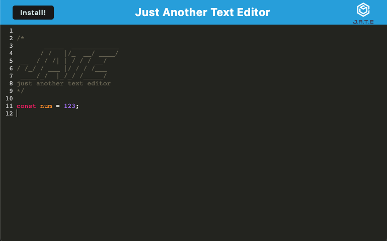

# Just Another Text Editor (JATE)

  ## Table of Contents
  1. [Description](#description)
  2. [Installation](#installation)
  3. [Usage](#usage)
  4. [License](#license)
  5. [Author](#author)


  ## Description
PWA single page text editor program. It features a number of data persistence techniques that serve as redundancy in case one of the options is not supported by the browser. The application is deployed on Heroku and also functions offline and can be installed on your computer as a native app. It has the following interface:




[Deployed on Heroku.](https://evening-oasis-33077.herokuapp.com/)

See the application's GitHub repository [here.](https://github.com/sevrinbe/text-editor)

  
  ---
  ## Installation
  Clone my repository on GitHub.
  
  To install the application's `dependencies` and `devDependencies`, run:
  ```
  npm install
  ```
  
  To invoke the application, run:
  ```
  npm run start
  ```
  
  ---
  ## Usage
  Please see screenshot.

  ---
  ## License
  Permission is hereby granted, free of charge, to any person obtaining a copy of this software and associated documentation files (the "Software"), to     deal in the Software without restriction, including without limitation the rights to use, copy, modify, merge, publish, distribute, sublicense, and/or   sell copies of the Software, and to permit persons to whom the Software is furnished to do so, subject to the following conditions:
      
  The above copyright notice and this permission notice shall be included in all copies or substantial portions of the Software.
      
  THE SOFTWARE IS PROVIDED "AS IS", WITHOUT WARRANTY OF ANY KIND, EXPRESS OR IMPLIED, INCLUDING BUT NOT LIMITED TO THE WARRANTIES OF MERCHANTABILITY,       FITNESS FOR A PARTICULAR PURPOSE AND NONINFRINGEMENT. IN NO EVENT SHALL THE AUTHORS OR COPYRIGHT HOLDERS BE LIABLE FOR ANY CLAIM, DAMAGES OR OTHER       LIABILITY, WHETHER IN AN ACTION OF CONTRACT, TORT OR OTHERWISE, ARISING FROM, OUT OF OR IN CONNECTION WITH THE SOFTWARE OR THE USE OR OTHER DEALINGS     IN THE SOFTWARE.
    
  ## Badges
  
  [](https://opensource.org/licenses/MIT)
  ## Author
Sevrin Eldred -  [Github](https://github.com/sevrinbe)
